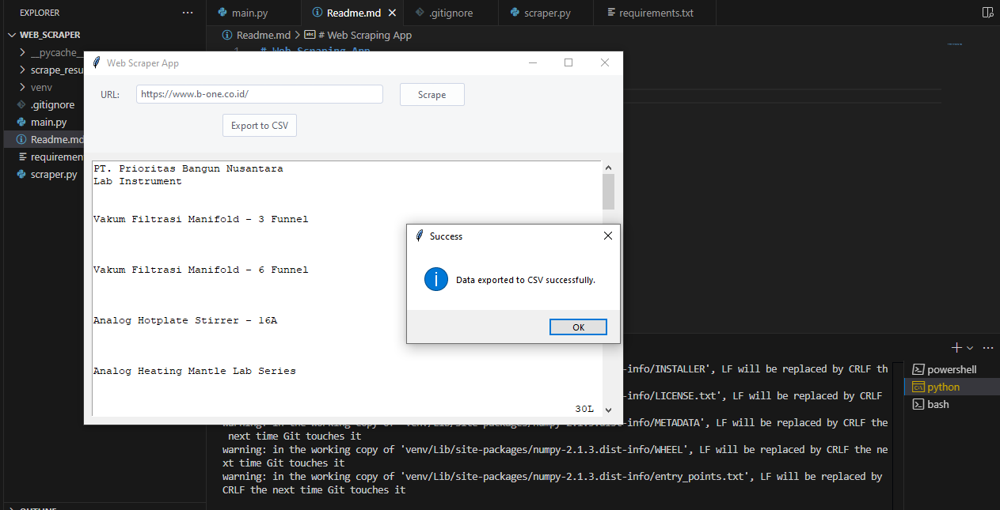
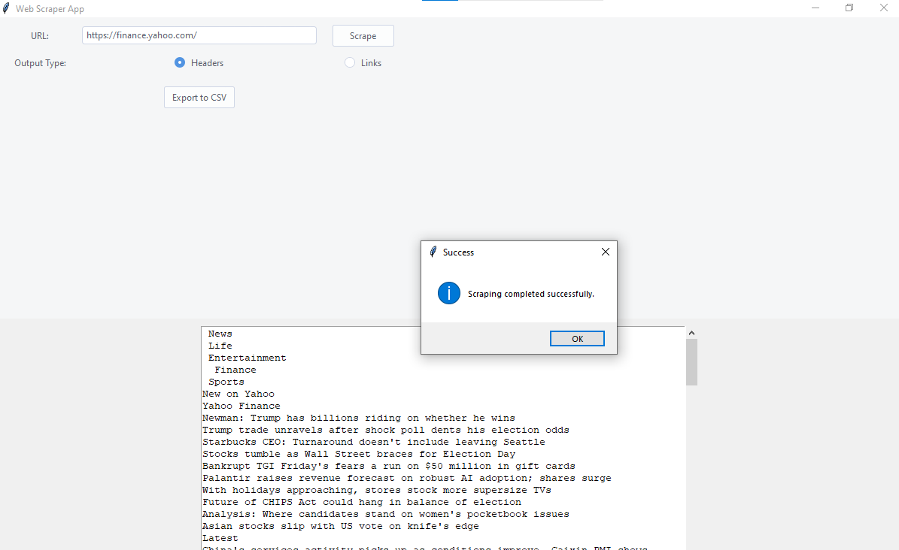
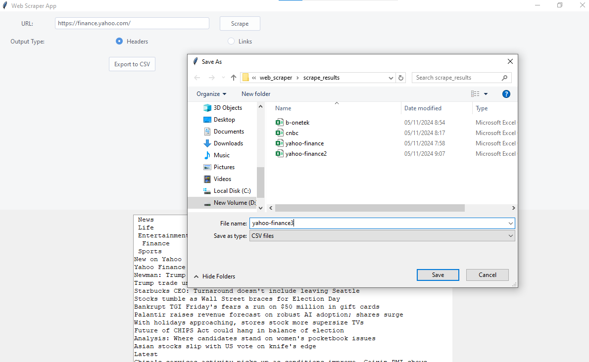
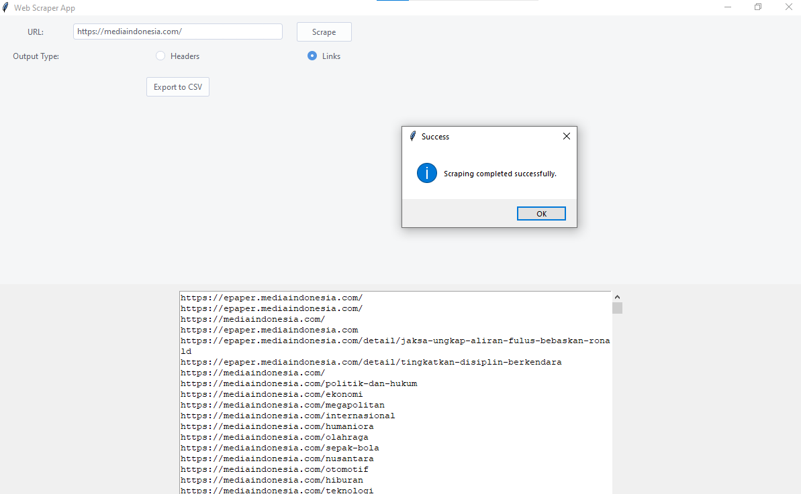

# Web Scraping App

Create webscraper with  the following features:
-   Scrapes data from a website
- Create with Python GUI interface TKinter.
-   Stores scraped data in a CSV  file
-   Allows user to input the website URL and the number of pages to scrape
-   Allows user to input the number of rows to store in the CSV file
-   Allows user to input the number of columns to store in the CSV file
-   Allows user to input the number of columns to scrape from the website
-   Allows user to input the number of rows to scrape from the website
- Easy to  use and friendly interface
- Error handling for invalid inputs
- further improvements and development to be made in the future.

### Update

